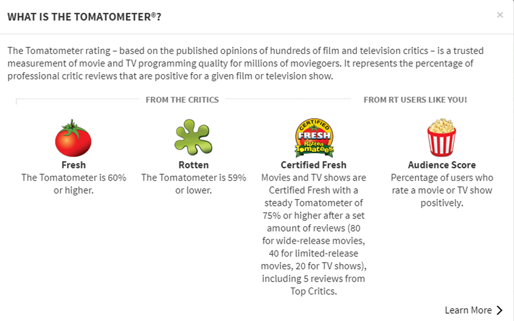
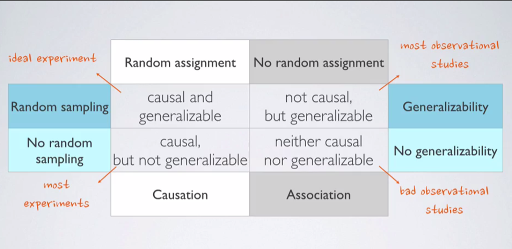
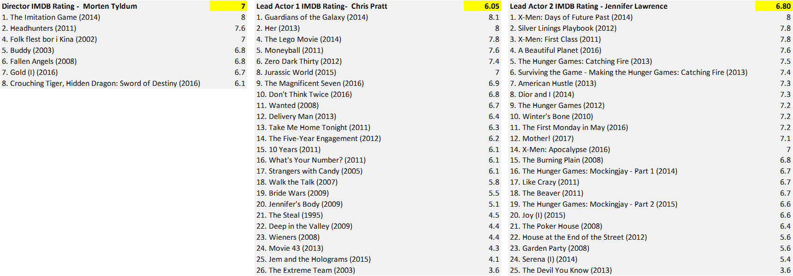

## Setup

### Load packages

```{r load-packages, message = FALSE}
library(ggplot2)
library(dplyr)
library(statsr)
library(GGally)
```

### Load data

Make sure your data and R Markdown files are in the same directory. When loaded
your data file will be called `movies`. Delete this note when before you submit 
your work. 

```{r load-data}
load("movies.Rdata")
```


* * *

## Part 1: Data
The given database comprises of information related to movies.There are observations related to 651 movies. Movie title, year of release, genre, lead actors, IMDB rating, Rotten Tomato ratings are some of the key information fields. Overall, there are 32 variables(information fields) for each of the 651 movies.


#### How is the data collected?
These 651 movies have been randomly selected.
Most of the information related to movies are facts.

However, the information related to movies popularity are based on user ratings and score from IMDB and Rotten Tomatoes.

IMDB rating for a given movie is a weighted score of all the votes casted by IMDb registered users. A weighted average means that some votes have more weight than others in the calculations.
They do not disclose their rating scheme. However, they ensure that the same criteria is uniformly used to calculate all the ratings for all the movies in their database.

Details about their rating methodology can be found in their website.  
Source: http://www.imdb.com/help/show_leaf?votestopfaq.


Rotten Tomatoes provides both critics rating and audience ratings. Critics rating is called the "The Tomatometer" and is the percentage of approved critics who have given that movie a positive rating. Although the percentage score by itself is a numerical variable, the tomatometer rating is categorical (refer to the image below). 

*Tomatometer Rating\ref{tmr.png}*

{width=50%}


#### Implication on Causality/Generalizability
Since the observed data on movies is random, and there is no random assignment of the people surveyed into any control or experimental groups, therefore no causal inferences can be made. However, the inferences can be generalized to the population.

*Causalilty-Generalizability Matrix\ref{cgm.png}* 

{width=50%}
Since the score in both IMDB and Rotten Tomatoes is based on all registered users, who are across the globe, the population data is random. The chances of bias in scoring is also equally likely both within the individual scores of a given movie and between movies.


* * *

## Part 2: Research question

####**What are the most influential attributes that make the movie popular?** 

* * *

## Part 3: Exploratory data analysis
Lets look at the variables that reflect movie popularity.  
They are:  
1.IMDb_rating: Rating on IMDB  
2.critics_rating: Categorical variable for critics rating on Rotten Tomatoes (Certified Fresh, Fresh, Rotten)  
3.critics_score: Critics score on Rotten Tomatoes  
4.audience_rating: Categorical variable for audience rating on Rotten Tomatoes (Spilled, Upright)  
5.audience_score: Audience score on Rotten Tomatoes  

Both IMDB and Rotten Tomatoes provide scores for movie popularity.
```{r IMDB vs Rotten Tomatoes}
ggplot(data = movies, aes(x = audience_score, y = imdb_rating)) +
  geom_point() +
  stat_smooth(method = "lm", se = TRUE)
```

As we can see, both the scores are highly correlated.

####For the purpose of movie popularity, we will consider **IMDB rating** as more reflective of general population, as we have a high number of votes for every movie at IMDB.####

```{r eda1}
boxplot(movies$imdb_rating~movies$thtr_rel_year)
```


```{r runtime}
summary(movies$runtime)
```

Since 75% of the movies are less than 2 hours, we will consider any movie above 2 hours duration as "long". Any movie of 2 hours or less duration will be considered as "normal"
```{r add duration}
movies<-movies%>%
  mutate(duration=ifelse(movies$runtime > 120, "long", "normal"))
```


####I personally believe that movie popularity is heavily dependent on the Director and the star cast.

####Hence, I will create few other variables that will show the average IMDB rating of director and main leads (actor1 and actor2).

```{r dir}
dir<-movies%>%
  group_by(director)%>%
    summarise(mean(imdb_rating),n(),mean(audience_score))
colnames(dir)<-c("director","dir_rating","dir_n","dir_rtscore")
dir<-dir%>%arrange(desc(dir_rating))


```

```{r actor1}
ac1<-movies%>%
  group_by(actor1)%>%
    summarise(mean(imdb_rating),n(),mean(audience_score))
colnames(ac1)<-c("actor1","ac1_rating","ac1_n","ac1_rtscore")
ac1<-ac1%>%arrange(desc(ac1_rating))
```

```{r actor2}
ac2<-movies%>%
  group_by(actor2)%>%
    summarise(mean(imdb_rating),n(),mean(audience_score))
colnames(ac2)<-c("actor2","ac2_rating","ac2_n","ac2_rtscore")
ac2<-ac2%>%arrange(desc(ac2_rating))
```


```{r merge df}
movies<-merge(movies,dir,by="director")
```

```{r merge df2}
movies<-merge(movies,ac1,by="actor1")
```

```{r merge df3}
movies<-merge(movies,ac2,by="actor2")
```

* * *

## Part 4: Modeling

Since there are many variables, I have broken down these variables into logical chunks/sets to create the linear regression model.
Also, since we are interested in predicting the output based on given set of variables, we will use the Adjusted R Squared value for detemining the significance of the variables.

Set 1 comprises of variables that I felt should have least impact on movie popularity. I selected title_type, studio, mpaa_rating and movie duration.

```{r plot genre}
par(mfrow=c(2,2))
boxplot(movies$imdb_rating~movies$title_type)
boxplot(movies$imdb_rating~movies$studio)
boxplot(movies$imdb_rating~movies$mpaa_rating)
boxplot(movies$imdb_rating~movies$duration)
```

```{r Set1}
lm_set1 <- lm(imdb_rating ~ title_type+studio+mpaa_rating+duration,	data = movies)
summary(lm_set1)
```

**These variables can estimate only 28% of the variability of IMDB scores, which is not so high as expected.**
 
####Next, we will test the new variables that we created, namely the Average IMDB ratings of the Director, main star cast (Actor1 and Actor2).
Also, I am not sure how genre impacts movie popularity. So I will include genre as well in these set of variables.

```{r}
par(mfrow=c(2,2))
boxplot(movies$imdb_rating~movies$dir_rating)
boxplot(movies$imdb_rating~movies$ac1_rating)
boxplot(movies$imdb_rating~movies$ac2_rating)
boxplot(movies$imdb_rating~movies$genre)
```


From these box plots, it looks very clear that there is strong evidence for atleast variables namely the average of the IMDB ratings of the director and star cast previous movies.

```{r Set2}
lm_set2 <- lm(imdb_rating ~ dir_rating + ac1_rating +ac2_rating +genre ,	data = movies)
summary(lm_set2)
```
**The results are fantastic as these variables are explaining 95.5% of the variability in IMDB score.**

Let's try to remove genre and check if the Adjusted Rsquared value reduces significantly or not.

```{r Set3}
lm_set3 <- lm(imdb_rating ~ dir_rating + ac1_rating +ac2_rating ,	data = movies)
summary(lm_set3)
```
**As we can see, even after removing genre from the linear model, the Adjusted R squared remains at 0.9556.**

####This provides us with a very simple linear model comprising of only 3 variables, through which we can predict possible IMDB rating for movie popularity.####


* * *

## Part 5: Prediction

####Linear Model for predicting IMDB Score is 

####[imdb_rating = -0.41 + dir_rating \* 0.45 + ac1_rating \* 0.17  + ac2_rating \* 0.44]

For testing this model, I have selected a random movie from 2016.   
Name of the Movie is  **Passengers**.
 

{width=50%}

Director: Morten Tyldum(dir)
Stars: Chris Pratt(ac1), Jennifer Lawrence(ac2),  

{width=100%}

Now, we will fit the values in the linear model, to predict the IMDB Score of this movie.

####[imdb_rating = -0.41 + dir_rating \* 0.45 + ac1_rating \* 0.17  + ac2_rating \* 0.44]

####[imdb_rating = -0.41 + 7.0 \* 0.45 + 6.05 \* 0.17  + 6.80 \* 0.44]

####[imdb_rating = 6.8]

####The Actual IMDB rating for this movie is 7.0.

####This can also be done using the "predict" function.

```{r predict}
Passengers <- data.frame(dir_rating= 7.0 , ac1_rating= 6.05 , ac2_rating= 6.80 )
predict(lm_set3,Passengers,interval = "prediction",level=0.95)
```


* * *

## Part 6: Conclusion

####Linear regression model is fairly accurate in its prediction of IMDB score.

My key learnings: Ideally, I should have started with a full scale model for linear regression and elminated each variable at a time. However, I found it useful to break the data into meaningful chunks. 

For example, in my exercise above I found that set1 was not a significant predictor. Hence, I double checked my inference by running the full model. 
By adding set 1 variables to set2 variables further reduced the adjusted R squared significantly. 

Also, conducting exploratory data analysis is critical to help make meaningful selections.

**End of Document**
